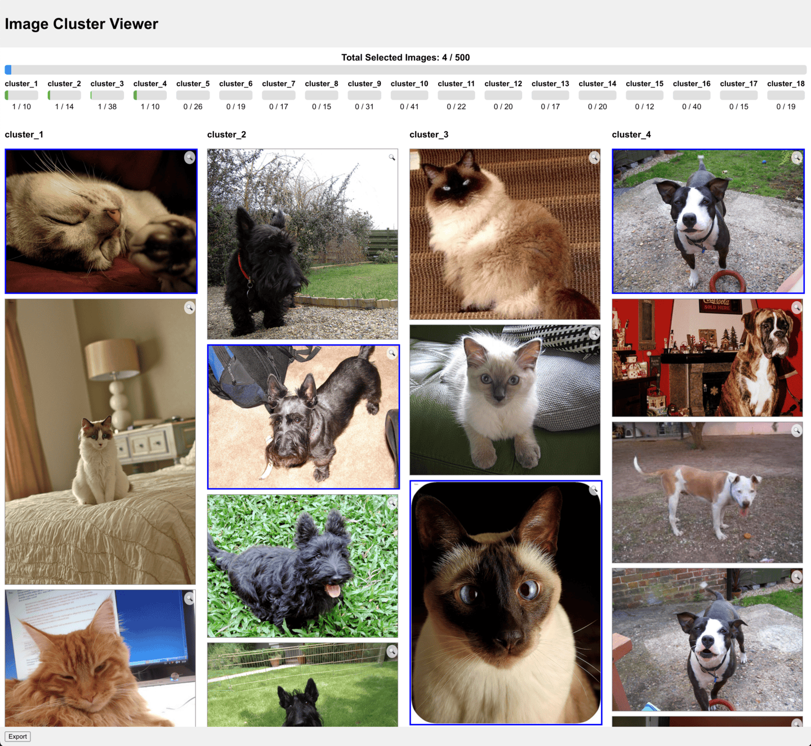

# Dataset Cluster Tool

## Overview

This application clusters images and provides a web interface for selecting representative images from each cluster.



## Project Structure

- `backend/`: Contains server code and clustering script.
  - `scripts/`: Python script for clustering images.
  - `data/`: Contains `dataset/`, `clusters/`, and `exported_images/`.
- `frontend/`: React application for the web interface.

## Setup Instructions

### Prerequisites

- Node.js and npm
- Python 3.x and pip

### Backend Setup

1. Navigate to the backend directory:

   ```bash
   cd backend
   ```

2. Install Node.js dependencies:

   ```bash
   npm install
   ```

3. Install Python dependencies:

   ```bash
   pip install -r scripts/requirements.txt
   ```

4. Prepare your dataset:

   - Place your images in `backend/data/dataset/`.

5. Run the clustering script:

   ```bash
   npm run cluster
   ```

6. Start the server:

   ```bash
   npm start
   ```

### Frontend Setup

1. Navigate to the frontend directory:

   ```bash
   cd frontend
   ```

2. Install dependencies:

   ```bash
   npm install
   ```

3. Start the React application:

   ```bash
   npm start
   ```

4. Open your browser and navigate to `http://localhost:3000`.

## Usage

- Use the web interface to view image clusters.
- Click on images to select or deselect them.
- Click the "Export" button to save selected images to `backend/data/exported_images/`.

## Appendix

### Appendix A: Installing Node.js and npm

This project requires **Node.js** and **npm** (Node Package Manager) to run the server and client applications. If you do not already have Node.js and npm installed, please follow the instructions below for your operating system.

#### Windows

1. **Download the Installer**:

   - Visit the official Node.js website at [https://nodejs.org/](https://nodejs.org/).
   - Download the **LTS** (Long Term Support) version for Windows.

2. **Run the Installer**:

   - Locate the downloaded `.msi` file and double-click to run it.
   - Follow the prompts in the setup wizard.
   - Accept the license agreement and use the default installation settings.

3. **Verify the Installation**:

   - Open **Command Prompt** or **PowerShell**.
   - Run the following commands:

     ```bash
     node -v
     npm -v
     ```

   - You should see the version numbers of Node.js and npm, confirming they are installed.

#### macOS

1. **Download the Installer**:

   - Go to [https://nodejs.org/](https://nodejs.org/).
   - Download the **LTS** version for macOS.

2. **Run the Installer**:

   - Open the downloaded `.pkg` file.
   - Follow the installation steps provided by the installer.

3. **Verify the Installation**:

   - Open **Terminal**.
   - Run:

     ```bash
     node -v
     npm -v
     ```

   - You should see the version numbers displayed.

#### Alternative Method Using nvm (Node Version Manager)

You can also use **nvm** to install Node.js and npm, which allows you to manage multiple versions.

1. **Install nvm**:

   ```bash
   curl -o- https://raw.githubusercontent.com/nvm-sh/nvm/v0.39.4/install.sh | bash
   ```

   - Note: Replace `v0.39.4` with the latest nvm version if necessary.
   - Close and reopen your terminal, or run `source ~/.nvm/nvm.sh`.

2. **Install Node.js LTS Version**:

   ```bash
   nvm install --lts
   ```

3. **Verify the Installation**:

   ```bash
   node -v
   npm -v
   ```

### Appendix B: Uninstalling Node.js and npm

If you wish to uninstall Node.js and npm after using this project, follow the steps for your operating system.

#### Windows

1. **Open Control Panel**:

   - Go to **"Control Panel"** > **"Programs"** > **"Programs and Features"**.

2. **Uninstall Node.js**:

   - Find **"Node.js"** in the list of installed programs.
   - Select it and click **"Uninstall"**.
   - Follow the prompts to complete the uninstallation.

3. **Delete Remaining Files** (Optional):

   - Delete any remaining files in the installation directory, usually `C:\Program Files\nodejs`.

#### macOS

If you installed Node.js via the installer:

1. **Remove Node.js and npm**:

   ```bash
   sudo rm -rf /usr/local/bin/node
   sudo rm -rf /usr/local/lib/node_modules/npm
   sudo rm -rf /usr/local/lib/node_modules/corepack
   sudo rm -rf /usr/local/include/node
   sudo rm -rf /usr/local/lib/node
   sudo rm -rf /usr/local/bin/npm
   sudo rm -rf /usr/local/bin/npx
   sudo rm -rf /usr/local/share/man/man1/node.1
   sudo rm -rf /usr/local/share/systemtap/tapset/node.stp
   ```

   - **Warning**: Be very careful with the `rm -rf` command to avoid deleting unintended files.

2. **Delete Local npm Configurations** (Optional):

   ```bash
   rm -rf ~/.npm
   rm -rf ~/.nvm
   ```

   - This removes global npm and nvm configurations.

Alternatively, if you installed Node.js via **Homebrew**:

1. **Uninstall Node.js**:

   ```bash
   brew uninstall node
   ```

2. **Remove Any Remaining Files** (Optional):

   ```bash
   brew cleanup
   ```
   
##### If Installed via nvm

1. **Uninstall Node.js Versions**:

   ```bash
   nvm uninstall <version>
   ```

   - Replace `<version>` with the version number, e.g., `nvm uninstall 14.17.0`.

2. **Uninstall nvm**:

   ```bash
   rm -rf "$NVM_DIR"
   ```

   - Usually, `$NVM_DIR` is located in `~/.nvm`.

### Appendix C: Cleaning Up Project Files

After uninstalling Node.js and npm, you can also remove the project files:

1. **Delete the Project Directory**:

   - Navigate to the parent directory of the project.
   - Remove the project folder:

     ```bash
     rm -rf "Dataset Cluster Tool"
     ```

2. **Remove Global npm Packages** (Optional):

   - If you have installed any global npm packages, you can remove them:

     ```bash
     npm list -g --depth=0
     npm uninstall -g <package_name>
     ```

   - Replace `<package_name>` with the name of the package you want to remove.

---

## License

[MIT License](LICENSE)